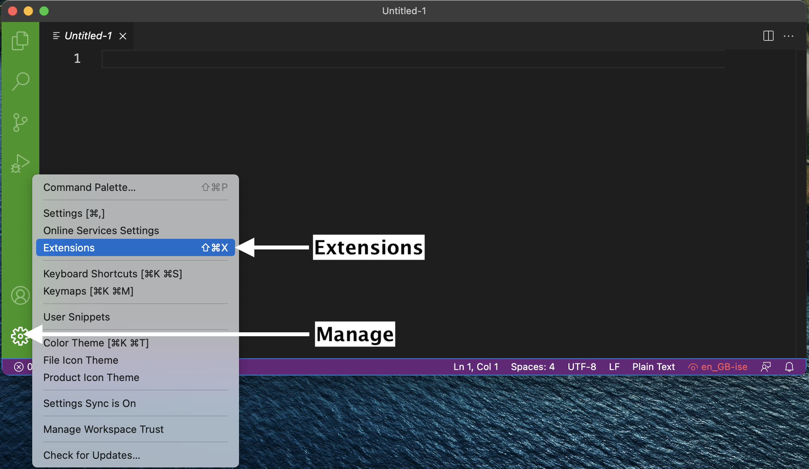

(page_install_macOS)=
macOS Software Stack
=======================

<head>
	<base target="_blank">
</head>

These instructions will walk you through installing the required software stack for {{ COURSE_CODE }}. 
Before starting, ensure that your laptop meets the minimum requirements:

- Runs a recent version of macOS. The following versions have successfully been setup using the instructions below
    - macOS Sonoma (14.2.x), Ventura (13.x) Monterey (12.x), BigSur (11.x). 
- Can connect to networks via a wireless connection
- Has at least 25 GB disk space available
- Has at least 4 GB of RAM (more is better, 8GB is recommended)
- Uses a 64-bit CPU
- Is at most 6 years old at the start of the course (4 years old or newer is recommended)
- Student user has full administrative access to the computer

If your computer does not meet any of the requirements above, please don't just drop the course!!
Let me know first and we can discuss alternate possibilities so you can still take the course.

```{tip}
Before starting, I suggest updating your Mac to the latest version your laptop can run:


```

## Installation notes

```{tip}
These installation notes assume that you are starting with a "fresh" install, and that you don't have any custom installations and setups.
If you have previously installed Python and any related packages, we recommend (but not require) you to uninstall these and follow the instructions below to install and configure them correctly for our course (make sure to also remove any user configuration files and backup them if desired).
```

Starting with macOS Catalina, Apple stopped including a pre-installed Python installation on macOS (believe it or not, this is a good thing because the version included was always out of date!).
In order to be able to support you effectively and minimize setup issues and software conflicts, we have written some instructions for all students to install the software stack the same way.

In all the sections below, if you are presented with the choice to download either a 64-bit (also called x64) or a 32-bit (also called x86) version of the application **always** choose the 64-bit version.
If you purchased a Mac anytime in the last few years, chances are you have an "M1/M2/M3"... Mac, also known as Apple Silicon, and `arm64`.
When given the option, you should choose to download the `arm64` or Apple Silicon versions - if that choice doesn't exist, then you can choose the "Universal" version which will run in "emulated mode", which will result in a slight performance penalty. 

## Table of Contents

<!-- - [UBC Student Email](#ubc-student-email) -->
- [Web browser](#web-browser)
- [Zoom](#zoom)
- [Git and GitHub](#git-and-github)
<!-- - [Microsoft Office](#microsoft-office) -->
- [Python](#python)
- [Visual Studio Code](#visual-studio-code)
- [Terminal](#terminal)
<!-- - [Test JupyterLab](#test-jupyterlab) -->
- [tree](#tree)

<!-- 
## UBC Student Email

Please sign up for a UBC Student Email. 
This account will also grant you access to a range of other UBC services (not used in this course), including Microsoft Teams and OneDrive. 
To do so navigate to [https://it.ubc.ca/services/email-voice-internet/ubc-student-email-service](https://it.ubc.ca/services/email-voice-internet/ubc-student-email-service) and follow the instructions under "Get Started". 
 -->

## Web browser

You are welcome to use most modern browsers that have a WebKit or Gecko backend.
[Safari](https://www.apple.com/ca/safari/), [Firefox](https://www.mozilla.org/en-CA/firefox/new/?redirect_source=firefox-com), [Vivaldi](https://vivaldi.com), [Brave](https://brave.com), [Edge](https://www.microsoft.com/en-us/edge) are all recommended.
Google Chrome is not recommended because of the [well-documented privacy and tracking issues with Google](https://www.forbes.com/sites/zakdoffman/2021/03/20/stop-using-google-chrome-on-apple-iphone-12-pro-max-ipad-and-macbook-pro/).

## Zoom

We will be using Zoom in this course for all the student hours and you should install the Zoom client locally on your machine.
It is important that you have the most recent version of Zoom installed, as we will be using many of the features that are only available in more recent versions.

The latest version of Zoom as of Sept 2022 is: `5.16.10 (25689)`. 
You can ensure you have the latest version of Zoom by clicking "Check for Updates" as shown in the screenshot below.


```{important}
Please note that if you have been relying on the "web version" of Zoom that works only in a browser, this will not work for this course! Please make sure to download the Zoom desktop client for your operating system to fully participate in the course.
```

## Git and GitHub

Sign up for a free account at [GitHub.com](https://github.com/) if you don't have one already.
Your GitHub username is important, here's how to find your username:


### Install Git on your computer

We will be using the command line version of Git.
Some of the Git commands we will use are only available since Git 2.23, so if your Git is older than this version, we ask you to update it using the Xcode command line tools (not all of Xcode), which includes Git.

```{tip}
To open a new Terminal, find the Terminal app on your computer (`Applications->Utilities->Terminal`) or activate Spotlight and type in Terminal and then enter.
You will need to do this several times in these instructions.
```

Open your Terminal and type the following command to install Xcode command line tools:

```
xcode-select --install
```

After installation, in Terminal type the following to check the version:

```
git --version
```

You should see something like this (does not have to be the exact same version) if you were successful:

```
git version 2.40.0
```

```{note}
If you run into trouble, this is the time to post on {{ FORUM_LINK }} with your error message and ask for help!
```

### Configuring Git user info

Next, we need to configure Git by telling it your name and email.
To do this type the following into the Terminal (the same ones you used to sign up for GitHub):

```
git config --global user.name "YOUR NAME HERE"
git config --global user.email YOUR@EMAIL.com
```

```{note}
To ensure that you haven't made a typo in any of the above, you can view your global Git configurations by either opening the configuration file by typing `git config --list --global`. You can quit this view by just pressing the `q` key on your keyboard.
```

### Create your GitHub "Personal Access Token"

This is a bit tricky, so please make sure you follow these directions carefully.

1. Create a Personal Access Token on GitHub.com by clicking this link: https://github.com/settings/tokens/new; make sure to COPY the token that they give you, it is basically a special password that you can use in the Terminal.
Detailed steps are:

- Log in to GitHub.com, 
- Click your picture in the top right, 
- Click Settings, 
- Click Developer Settings
- Click "Personal access tokens", set the appropriate permissions at the "repo" level (see image below):

```{figure} setup_images/repo.png
---
name: PAT_mac
---
Personal Access Token settings
```


- Click "Generate new token"
- Save this token somewhere on your computer, you will need it when you clone a **private** repository to your computer.
- Don't share your token with anyone and protect it like it's your password! You will not be able to come back to this page to get your token. If you forget it, or lose it, you can just delete the token and create another one.

### Clone your first repository on your computer!

Open a Terminal window, and then run the following command:

```
git clone https://github.com/firasm/test.git
```

Hopefully, if things work, you should be able to see a new folder created at that location.
We will be talking more about what exactly you did over the next week and a bit, don't worry!

```{tip}
If after running the code above, you see the error message:

> fatal: destination path 'test' already exists and is not an empty directory. 

It means that you already attempted a clone before, and there is already a directory called `test` where you are trying to clone this repository.
You will first need to delete that directory to try again.

Open a Finder window on your computer, navigate to the directory, right click the `test` directory, and then delete the directory.
Alternatively, from the command line you can try:

> rm -rf test

which will "remove" the directory called "test". The "-" is to specify additional options: `r` means "recursively" for all the files in the directory, and `f` means "force" which means don't ask me for confirmation after deleting each file and folder.
```

<!-- 
## Microsoft Office

UBC students have free access to a Microsoft Office 365 annual subscription, which is renewed for students enrolled in at least one course.
Office 365 includes Word, Excel, PowerPoint, Outlook, and OneNote, and is available on a variety of platforms.

To get your free Office 365 license and download the installer files, visit [UBC IT](https://it.ubc.ca/services/desktop-print-services/software-licensing/office-365-students) for the installation instructions.
Note that you will need your CWL login credentials in order to download the software and activate your license from [portal.office.com](https://portal.office.com).

In this course, you will need Microsoft Excel. 
-->

## Python

We are now ready to install Python!

We will be using Python for a large part of the course, and `conda` will be our Python package manager.
We will be using the [Miniconda installer (read more here)](https://docs.conda.io/en/latest/miniconda.html) to install both python and conda at the same time.
Miniconda also provides us with a minimum number of useful packages so installation is quick, and relatively painless.

### Installing `conda` and python

The latest Miniconda installer can be downloaded from here: [Miniconda macOS Apple M1 64-bit pkg install](https://repo.anaconda.com/miniconda/Miniconda3-latest-MacOSX-arm64.pkg).

After installation, restart the terminal.
If the installation was successful, you will see `(base)` prepending to your prompt string.
To confirm that `conda` is working, you can check in the Terminal if it's installed and which version was installed:
```
conda --version
```
which should return something like this:

```
conda 23.11.0
```

```{note}
Note: If you see `zsh: command not found: conda`, try the following>: Open a new Terminal (it should be zsh), then type: `source /Users/YOURUSERNAME/miniconda3/bin/activate` OR `source ~/miniconda3/bin/activate` depending on whether you installed for all users, or just your user (make sure to also change YOURUSERNAME to your username). Then enter the following command `conda init zsh`. The error should now be fixed.
```

Next, type the following to ask for the version of Python:
```
python --version
```
which should return something like this:

```
Python 3.11.5
```

```{note}
Note: If instead you see `Python 2.7.X` you installed the wrong version. Uninstall the Miniconda you just installed (which usually lives in the `/opt` directory), and try the installation again, selecting **Python 3.11** (or higher).
```

### Essential Python packages

`conda` is a Python package manager that can install packages from different online repositories which are called "channels".
A package needs to go through thorough testing before it is included in the default channel, which is good for stability, but also means that new versions will be delayed and fewer packages are available overall.
There is a community-driven effort called the [conda-forge (read more here)](https://conda-forge.org/), which provides more up-to-date packages.
To enable us to access the most recent versions of the Python packages we are going to use, we will add this channel.
To add the conda-forge channel type the following in a Terminal window:

```
conda config --add channels conda-forge
```

To install packages individually, we need to use the following command: `conda install -c conda-forge "<package-name>"`.
The part about `conda install` tells the `conda` package manager to install a particular package, and the `-c` part is an extra "option" that tells `conda` to look in the `conda-forge` channel (which usually has the latest updated packages).
Let's install the key packages needed (you will note that we're also specifying certain versions of the package with `= X.Y`).
You should copy and paste each line (one-by-one) below in your Terminal to install the following packages:

```
conda install -c conda-forge "black"
conda install -c conda-forge "pandas"
conda install -c conda-forge "seaborn"
conda install -c conda-forge "pre-commit"
```

`conda` will show you the packages that will be downloaded, and you may need to press `enter` or `Y` (for yes) to proceed with the installation.
This may take a while to complete.

```{tip}
We will be installing more Python packages as we go through the course!
```

## Visual Studio Code

The open-source text editor Visual Studio Code (VS Code) is both a powerful text editor and a full-blown Python IDE (interactive development environment), which we will use for more complex analysis.
You can download and install the macOS version of VS Code from the VS code website [https://code.visualstudio.com/download](https://code.visualstudio.com/download).
Once the download is finished, click "Open with Archive utility", and move the extracted VS Code application from "Downloads" to "Applications".
Make sure you are able to open VS Code by clicking on the application.

### VS Code extensions

The real magic of VS Code is in the extensions that let you add languages, debuggers, and tools to your installation to support your specific workflow.
We will install some VS Code extensions to help us with our workflows.
From within VS Code you can open up the [Extension Marketplace (read more here)](https://code.visualstudio.com/docs/editor/extension-gallery) to browse and install extensions by clicking on the Extensions icon in the Activity Bar indicated in the figure below.



To install an extension, you simply search for it in the search bar, click the extension you want, and then click "Install".
There are extensions available to make almost any workflow or task you are interested in more efficient!
Here we are interested in setting up VS Code as a Python IDE.
To do this, search for and install the following extensions:

- **Python** (by Microsoft)
- **Python Debugger** (by Microsoft)
- **autoDocString** (by Nils Werner)
- **Python Indent** (by Kevin Rose)
- **Black Formatter** (for formatting, linting)
- **Markdown Table Formatter** (helps format markdown tables)
- **Rainbow CSV** (for colouring columns in CSV files)
- **indent-rainbow** (for helping you see indents)
- **markdownlint** (markdown linting and style checking extension)


<!-- 
[This video tutorial](https://www.youtube.com/watch?v=06I63_p-2A4) is an excellent introduction to using VS Code in Python.
 -->

## Terminal

The Terminal is already pre-installed on macOS as long as you're running macOS Big Sur or later (macOS 11.x)!

You can proceed to spice up your Terminal a bit!

### Install Ohmyzsh to get Terminal colours, and highlighting

Install `Ohmyzsh` to add Terminal colours, highlighting and other cool features.

Oh My Zsh is installed by running the following command in your Terminal: 

```
sh -c "$(curl -fsSL https://raw.githubusercontent.com/ohmyzsh/ohmyzsh/master/tools/install.sh)"
```

You may now customize your Terminal with themes (see [screenshots of themes here](https://github.com/ohmyzsh/ohmyzsh/wiki/Themes)) by [following the directions here](https://github.com/ohmyzsh/ohmyzsh#selecting-a-theme).
Selecting a theme is optional, the default one is pretty good as it is!

<!-- 
Apple recently changed the Mac default shell in the Terminal to Zsh - though the [reasons for this](https://thenextweb.com/dd/2019/06/04/why-does-macos-catalina-use-zsh-instead-of-bash-licensing/) are complicated, it is a huge improvement over the out-dated Bash version that came pre-installed on macOS.

If you are already on macOS Monterey (macOS 12.5) or Big Sur (macOS 11.x), this change is already made for you. 
But if you are on Catalina (macOS 10.x), you should switch your shell. 

To check which shell you are running, open a new Terminal (`Applications->Utilities->Terminal` or activate Spotlight and type in Terminal).
You will see a new window pop up and a blinking cursor.
Type in the following command:

```
echo $0
```

If you are running a `bash` shell, you will see the output as `bash`.
If you are running a `zsh` shell, you will see the output as `-zsh`. 
To make sure your shell is set to zsh, run this command:

```
chsh -s $(which zsh)
```
You may be prompted for your macOS administrative user password.
Enter the password, quit the terminal (`File->Quit` or `Command+Q`), and open it up again. 
-->

### Configure VS Code to launch from the Terminal

1. Launch VS Code.
2. Open the Command Palette (⇧⌘P ; Shift+Command+P).
3. Type 'shell command' to find the "Shell Command: Install 'code' command in PATH" command.
4. Hit Enter
5. Restart the Terminal for the new $PATH value to take effect. 

You can open files in VS Code from the Terminal!
Alternatively, just type `code .` in any folder to start editing files in that folder.

You can test that VS Code is installed and can be opened from Terminal by restarting Terminal and typing the following command in a Terminal:

```
code --version
```

you should see something like this if you were successful:

```
1.85.2
8b3775030ed1a69b13e4f4c628c612102e30a681
arm64
```

If this does **not** work for you, try it again:

1. Restart VS Code.
2. Open the Command Palette (⇧⌘P ; Shift+Command+P).
3. Type 'shell command' to find the "Shell Command: Uninstall 'code' command from PATH".
4. Hit Enter.
5. Type 'shell command' to find the "Shell Command: Install 'code' command from PATH".
6. You might need to enter in your Mac's admin password. 

If this **still* does not work, then you should ask a TA for help, but if you're feeling brave, 
[manual install instructions are here - remember to use the `zsh` files](https://code.visualstudio.com/docs/setup/mac#_launching-from-the-command-line) steps as well.

### Setting VS Code as the default editor

To make programs run from the Terminal (such as `git`) use VS Code by default, we will modify `~/.z_profile`. First, open it using VS Code:

```
code ~/.z_profile
```

```{note}
If you see any existing lines in your `~/.z_profile` related to a previous Python installation, please remove them.
```

Paste the following lines in the new file that opens up:

```
# Set the default editor for programs launch from Terminal
EDITOR="code --wait"
VISUAL=$EDITOR  # Use the same value as for "EDITOR" in the line above
```

Then save the file and exit VS Code.

> Most Terminal programs will read the `EDITOR` environmental variable when determining which editor to use, but some read `VISUAL`, so we're setting both to the same value.

## Tree

"Tree is a recursive directory listing program that produces a depth indented listing of files."
This is very useful to explore your directory and file structure to figure out which files are where.

You can install the `tree` package using this command:

`conda install -c conda-forge tree`

<!-- 
## Test JupyterLab 

To test that your JupyterLab installation is functional, open a new Terminal window.
Then type `jupyter lab` and then hit enter.
This should open a new tab in your default browser with the JupyterLab interface.
To exit out of JupyterLab you can click `File -> Shutdown`,
or go to the terminal from which you launched JupyterLab and hold `Ctrl` while pressing `c` twice.

You should see something like this in your browser:


 -->

After this, you're all done!

## Attributions

* [Harvard CS109](http://cs109.github.io/2015/)
* [UBC STAT 545](http://stat545.com/packages01_system-prep.html#mac-os-system-prep) licensed under the [CC BY-NC 3.0](https://creativecommons.org/licenses/by-nc/3.0/legalcode).
* [Software Carpentry](https://software-carpentry.org/)

```{important}
These instructions have been adapted and remixed from the original version provided by the UBC-Vancouver [MDS Install stack](https://ubc-mds.github.io/resources_pages/installation_instructions/) under a CC-BY-SA 4.0 license. They were originally written by [Anmol Jawandha](https://github.com/Anmol6) but have since been updated by Firas Moosvi, Joel Ostblom, Tomas Beuzen, Rodolfo Lourenzutti, & Tiffany Timbers, and others.
```