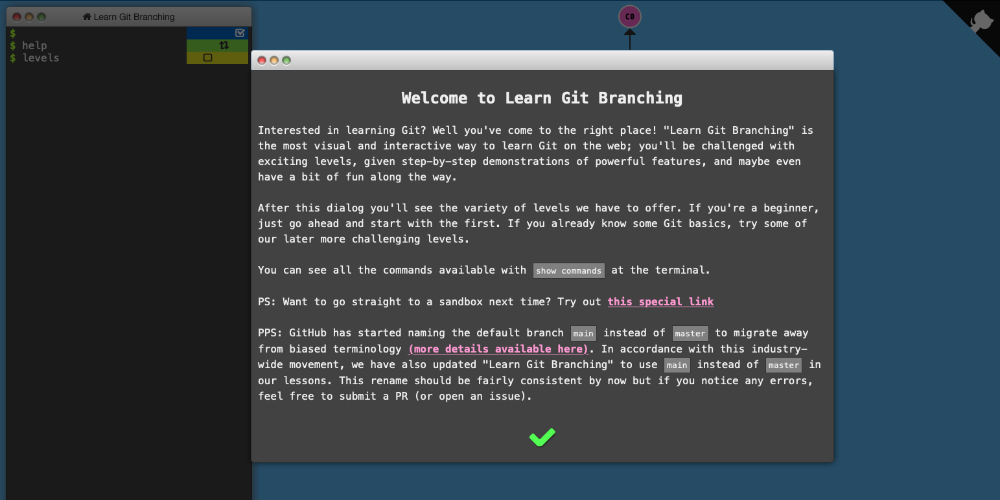

# Class Meeting 6A

Below are the slides from today's class embedded.
Feel free to download them to keep them locally, or leave them archived here and just bookmark them.
We will leave the website open even after the course is over for a reasonable number of years.

Today in class we will be doing a few demos of practical uses of git and version control.
For a good experience, you should come to class with your group mates, and sit close together.

<iframe src="../../Lec11_Git_VersionControl.pdf" width="100%" height="600px" frameBorder="0"> </iframe>

[Download the Slides from today](https://github.com/ubc-cs/cpsc203/raw/main/files/Lec11_Git_VersionControl.pdf)

## Version Control with Git

- Why git? (3 mins)
- The GitHub flow (5 mins)
- Introduction to Branches and Pull Requests (10 mins)
- Guided Activity 1: Intro to Git and GitHub (25 mins)
- Guided Activity 2: Code Reviews (10 mins)
- Git Summary and Review (15 mins)

### Why Git

### What is Git?

Image Source: [Noble Desktop](https://www.nobledesktop.com/blog/what-is-git-and-why-should-you-use-it).

## Learn Git Branching

## Request for Volunteers !

- You don't need to have any prior experience, nor do you have to be a computer pro.
- Probably will just ask you to share your screen and follow directions.
- I'll walk you through what you have to type and click and hopefully it's illustrative what needs to be done.
- You don't need to be a computer or git expert!

## Guided Activity 1: Intro to Git and GitHub

You will need to get into a group of 3 for this activity, and it would be best if you all sat together.

- Contributor 1
- Contributor 2
- Contributor 3

### Tasks:

- Get into groups of 3
- Accept a [**group** GitHub Classroom assignment](https://classroom.github.com/a/-GA1rFkW).
- Clone the repo locally using the Terminal.
- Open the repo in VS Code.
- Contributor 1,2,3 all independently make changes to fix their functions in VS Code
- Contributor 1,2,3 all commit to their repos BUT DO NOT PUSH!

## Guided Activity 2: Code Reviews

We'll now do a demo on how to submit a Pull Request, and do a code review.

## Useful Git Commands

Here are some command sequences that might be useful:

- `git status`
- `git clone ...`
- `git add .` or `git add -A`
- `git commit -m`
- `git switch -c 'person1'`
- `git switch -c 'person2'`
- `git add`, `git commit`, `git push`

## Important links for today:

- [GitHub Guide](https://github.com/git-guides)
- [Git Cheatsheet](https://enterprise.github.com/downloads/en/github-flow-cheatsheet.pdf)
- [LearnGitBranching](https://https://learngitbranching.js.org)

## Acknowledgements

Slides for {{ COURSE_CODE }} were developed and created by [Dr. Cinda Heeren](https://www.cs.ubc.ca/people/cinda-heeren). The current iteration of the course resulted in minor adaptations and updates, but by in large, full credit of these slides belongs to Dr. Cinda Heeren.