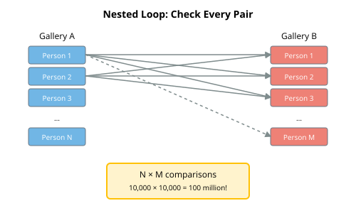
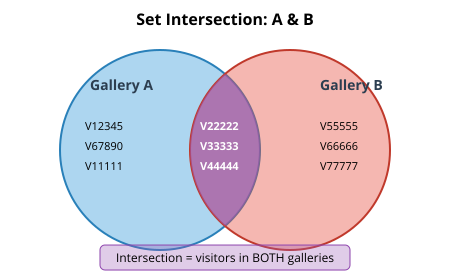

## Announcements

- Labs next week: Monday labs are cancelled due to the holiday.  Students can go to another lab section.
- Practice examlet 2 is available.  
- Examlet 2 **next** week (Thursday Oct 15 to Monday October 19).
- Lab 4 and POTW 4 due Sunday October 11, 8pm.
- Project 1 due Monday October 26, 8pm.

## The Setup: The Great Data Heist.

:::: {.columns}
::: {.column width="60%"}
Last night, someone broke into the **Vancouver Museum of Data Science**.

The thief stole the legendary **Golden DataFrame** — an artifact said to contain the answers to all data questions.

You've been called in as **data detectives** to solve the case.
:::
::: {.column width="40%"}

:::
::::

## Your Tool: The Dictionary

Dictionaries are Python's data structure for storing [key-value pairs](https://en.wikipedia.org/wiki/Name%E2%80%93value_pair).

- Given the *key*, we would like to quickly retrieve the corresponding *value*.

| Key | Value |
|-----|-------|
| name | Prof. Histogram |
| department | Statistics |
| alibi | was at the faculty meeting |
| motive | jealousy of the DataFrame's power |

- Launch [Class Activity: Dictionary Heist](https://us.prairielearn.com/pl/course_instance/228149/assessment/2722852/) in PrairieLearn.
- Open `data_heist_dictionaries.py`.

::: notes
Work through the `Dictionary basics` cell.

So we have a collection of data (the values) which should be managed together (the dictionary).

Why does that look familiar?
:::

# Dictionaries as Compound Data Representations

## Compound Data

Dictionaries / key-value lookup is yet another way to represent compound data:

| Representation | Elements | Data |
|----|----|----|
| lists | integer indexes 0 to $n$ | values |
| namedtuples | fields | values |
| dataclasses | attributes | values |
| row of a dataframe | columns | values |
| dictionary | keys | values |

::: notes
Why so many alternatives?  Compound data is really important!

Different representations have different levels of formality, different effort to construct, different capabilities, different efficiencies, ...

As an example, lists are great when you only need to index by consecutive integers starting from zero, or slices.  But they are terrible if you want to give your elements more meaningful names.
:::


## Billboard Hot 100 Data as a Dictionary

``` {pyodide}
# A list of dictionaries — each dict is a "record" with named fields
songs = [
    {"title": "Die With A Smile", "artist": "Bruno Mars", "rank": 1},
    {"title": "APT.", "artist": "Rose", "rank": 2},
    {"title": "Birds of a Feather", "artist": "Billie Eilish", "rank": 3},
]

# Access fields by name, not position
for song in songs:
    print(f"{song['rank']}. {song['title']} by {song['artist']}")
```


## Why Dictionaries (for Compound Data)? {.medium}

Dictionaries are probably *the most common* Python representation for compound data because

- They require no overhead to create (no class definition).
- Have very simple and compact syntax.
- Are extremely efficient for common operations on a single piece of compound data.
  - In particular, looking up a key takes the same amount of time regardless of the number of keys in the dictionary.

And the less you have to think about your data structure, the better.  Right?

::: notes
As an example, consider what happens if you ask for an element which doesn't exist.

- For lists, the only possible error is to ask for an index beyond $n$.  Common, but usually easy to avoid / debug.
- For namedtuples and dataclasses, it is possible to figure out before running the code that the field / attribute doesn't exist.  (Regular Python won't notice until you run, but some editors or lint scanners will warn you.)
- For dataframes and dictionaries, you cannot check until runtime.  Work through the `missing key` cell.

We used namedtuples for compound data in CPSC 103 because

- We wanted you to document your fields before you started using them.
- We did not want to introduce class notation.
:::

# Dictionaries as Key-Value Lookup

## Not Just a One-Trick Pony

Dictionaries / key-value lookup is useful for solving other common problems.

- Tracking membership.
- Counting appearances / frequencies.
- Representing a map over a discrete domain.
- Grouping by category.

::: notes
Remember that we often use lists for arbitrary sized data, but we sometimes use them for compound data?

We sometimes use dictionaries for compound data.  In these cases the keys are known at design time and the values are the data.

But we also use dictionaries for solving other problems.  In these cases both the keys **and** the values are part of the data representation.  We generally won't know either at design time, so the ability to create them at run-time is a feature.
:::

# 🚪 Room 1: Membership and Intersection

## Common Pattern: Tracking Membership {.medium}

For example: Have we seen this item before?

``` {pyodide}
from collections import defaultdict

# defaultdict(bool) returns False for missing keys
seen = defaultdict(bool)

# Mark something as seen
seen["apple"] = True
seen["banana"] = True

# Check if we've seen it — no KeyError!
if not seen["cherry"]:
    print("Cherry is new to us")

seen
```

`defaultdict(bool)` returns `False` for missing keys — no KeyError!

## Approach 1: Using Lists {.medium}

The thief visited **both** Gallery A and Gallery B before the theft.

**Your mission:** Find everyone who was in BOTH rooms.

Let's try using just lists:

1. Construct a list of everybody who visited Gallery A.
1. Construct a list of everybody who visited Gallery B.
1. For every person in list A:
     1. For every person in list B:
         1. If they match, add them to the intersection list.

::: notes
Work through `Intersection using Lists` cell.
:::


## The Problem with Nested Loops

::: {.columns}

::: {.column}

:::

::: {.column}
- With 10 people in Gallery A and 12 in Gallery B: **10 × 12 = 120 comparisons**
- With 10,000 in each: **100,000,000 comparisons!**
- With $n$ people in Gallery A and $m$ in Gallery B?
:::

:::

::: notes
But what if we used `in` keyword **instead** of the second loop?  

Same time for lists because checking membership for a list value requires time proportional to the length of the list.
:::


## Approach 2: Using Dictionaries

Let's try using dictionaries (and lists):

1. Construct a dictionary of everybody who visited Gallery A.
1. Construct a list of everybody who visited Gallery B.
1. For every person in list B:
   1. If they are in dictionary A, add them to the intersection list.

::: notes
Do we use the person's name as the key or the value?

- Looking up a key (or equivalently, testing 'in') in a dictionary is constant time.
- Looking up a value in a dictionary requires the same time as looking up a value in a list.

Work through `Intersection using Dictionary` cell.
:::

## Why Is This Faster?

- **Step 1:** Look at each Gallery A person once → 10 operations
- **Step 2:** Look at each Gallery B person once → 12 operations
- **Total:** 10 + 12 = **22 operations** (not 120!)

Dictionary lookup is **instant** — it doesn't matter how many keys are stored!

## Common Pattern: Set Intersection {.medium}

::: {.columns}

::: {.column}

:::

::: {.column}
``` {pyodide}
#| echo: false
first_list = [ 12345, 67890, 11111, 22222, 33333, 44444 ]
second_list = [ 22222, 33333, 44444, 55555, 66666, 77777 ]
```

``` {pyodide}
from collections import defaultdict
seen_in_first = defaultdict(bool)
for item in first_list:
    seen_in_first[item] = True

in_both = [item for item in second_list 
                if seen_in_first[item]]
print(in_both)
```
:::

:::

**Use when:** Finding common elements, detecting duplicates

::: notes
There is some hidden code which created the two lists of numbers.

What type would we have to use for the data values if we wanted to represent the IDs as shown in the figure?  String.
:::

## Alternative: Python Sets {.medium}

::: {.columns}

::: {.column}
``` {pyodide}
# Different options to create a set.
set_a = set([ 67890, 11111, 22222, 33333, 44444 ])
print(set_a)
set_b = { 22222, 33333, 66666, 77777 }
print(set_b)

# Can add single or multiple elements to a set.
set_a.add(12345)
print(set_a)
set_b.update([ 44444, 55555 ])
print(set_b)

# Creating an empty set is annoying.
print(type({}))
print(type(set([])))
```
:::

::: {.column}
``` {pyodide}
# Intersection, union, set difference.
print(set_a & set_b)
print(set_a | set_b)
print(set_a - set_b)

# Boolean operations.
print(12345 in set_a)
print(98765 in set_b)
print((set_a - set_b) <= set_a)
```
:::

:::

::: notes
There is also a `frozenset`, which is a set which cannot be mutated after creation.

Sets are a more natural way of implementing the intersection pattern and many others.  I encourage you to use them.  But they are a relatively recent addition to the language so you will still see a lot of code which uses dictionaries when sets would make more sense.  And our focus today is on key-value pairs / dictionaries, so we won't discuss them further.
:::

# 🚪 Room 2: Appearances and Frequencies

## Pattern: Counting Frequencies

**Use case:** Count how many times each item appears.

``` {pyodide}
# Counting letters in a word — the hard way
word = "mississippi"
counts = {}

for letter in word:
    if letter in counts:
        counts[letter] += 1
    else:
        counts[letter] = 1

print(counts)
```

::: notes
What would happen if we didn't include the check in the `if` statement?  `KeyError`.

:::


## Avoid the Extra Check?

Could use a `defaultdict(int)`, which would assign value of 0 to any missing key.

Alternatively, this pattern appears so often that there is an even more specialized version of a dictionary: `Counter`.

``` {pyodide}
from collections import Counter

word = "mississippi"
counts = Counter(word)

print(counts)
print(f"Most common: {counts.most_common(2)}")
```

::: notes
If you create a new `Counter` object and pass in something iterable (such as a list or string) whose values are immutable (such as any simple atomic data), then `Counter` will do its job automagically.
:::

## Room 2: The Cipher

You found a mysterious note left by the thief:

```
WKLV LV WKH FRGH: GLDJRQDO
```

It appears to be a **substitution cipher**. The thief replaced each letter with another.

## Frequency Analysis

In English, some letters appear more often than others:

| Letter | Frequency |
|--------|-----------|
| E | 12.7% |
| T | 9.1% |
| A | 8.2% |
| O | 7.5% |
| I | 7.0% |

If we count the letters in the cipher, the most common one is probably E!

::: notes
Work through the 

In fact, the mysterious note was a Caesar cipher — each letter shifted by the same amount.  The shift was -3 and the message was "THIS IS THE CODE: DIAGONAL".  The most common letter turns out to be 'I'...

It is not surprising that the frequency counting technique doesn't work on short messages.  And Caesar ciphers are terrible.  On Thursday we will look at more interesting ciphers.
:::

<!-- 
Ian removed a whole batch of slides here which showed how to shift letters by integer offsets to implement a Caesar cypher.  It may be interesting, but it had nothing to do with dictionaries...
-->

# 🚪 Room 3: Finding Complements

## Pattern: Finding Complements

**Use case:** Find two numbers that add up to a target.

``` {pyodide}
numbers = [3, 7, 1, 9, 4, 6, 2]
target = 10

# For each number, what do we NEED to find?
for n in numbers:
    complement = target - n
    print(f"{n} needs {complement} to make {target}")
```

## The Complement Pattern

``` {pyodide}
from collections import defaultdict

numbers = [3, 7, 1, 9, 4, 6, 2]
target = 10

seen = defaultdict(bool)
for n in numbers:
    complement = target - n
    if seen[complement]:  # No KeyError with defaultdict!
        print(f"Found pair: {complement} + {n} = {target}")
    seen[n] = True
```

As we scan, we remember what we've seen and check if the complement exists!

## Room 3: The Vault

The vault has a two-dial combination lock.

Each dial shows a number, and they must **multiply** to 435,599.

The thief left behind a piece of paper with two lists:

- 125, 204, 214, 242, 328, 350, 381, 659, 754, 854, 859
- 130, 132, 189, 195, 323, 532, 658, 661, 704, 792, 858

Find the two numbers (one from each list) that open the vault!

::: notes
There is no reason that "complement" has to be in terms of addition.  As long as we have an inverse operator, we can use dictionaries to quickly find the answer.

Work through 'Finding Complements' cells.

When we open the vault, we find a note: "The alibi is the key".
:::

# 🚪 Room 4: Grouping

## Pattern: Grouping by Category

**Use case:** Organize items into categories (like pandas' `groupby`!).

``` {pyodide}
from collections import defaultdict

fruits = [
    ("apple", "red"),
    ("banana", "yellow"),
    ("cherry", "red"),
    ("lemon", "yellow"),
    ("grape", "purple")
]

by_color = defaultdict(list)  # Missing keys auto-create empty lists
for fruit, color in fruits:
    by_color[color].append(fruit)

print(dict(by_color))
```

::: notes
Our data in this case is a list of tuples.  We want our categories to be the second elements and our values to be the first elements.

Why `defaultdict(list)`?  Without it you get a `KeyError`.

`defaultdict(list)` automatically creates an empty list for missing keys!

The trickiest part of using `defaultdict` is deciding the type of the values and the corresponding initialization value.  Often we are using the value as an accumulator, so we will initialize with a suitably "empty" accumulator: 0 for numbers, empty string for strings, empty list for lists, ...  Often the default value of the accumulator type is correct, but sometimes you may need to specify a different default value (for example, if you are computing a product then you want to start with 1 instead of 0).
:::

## Room 4: The Suspect Board

We have testimony from five suspects about where they were at 8pm:

``` {pyodide}
suspects = [
    {"name": "Prof. Histogram", "alibi": "faculty meeting", "verified": False},
    {"name": "Dr. Correlation", "alibi": "at a movie", "verified": True},
    {"name": "Ms. Outlier", "alibi": "working late", "verified": False},
    {"name": "Mr. Regression", "alibi": "faculty meeting", "verified": False},
    {"name": "Dean Bayes", "alibi": "at the gym", "verified": True},
]
```

Group suspects by their alibi to find who was together!

::: notes
What categories will we use for our groups?  What values do we want to put inside those groups?

What key-value pairs from the input will generate the keys in our group dictionary?

What key-value pairs from the input will generate the values in our group dictionary?  What form will these values take?

Work through `Room 4` cells.
:::

## Let's Practice! {.activity}

- Launch [Class Activity: Dictionary Heist](https://us.prairielearn.com/pl/course_instance/228149/assessment/2722852/) in PrairieLearn.
- Open `STUDENT_heist_nb.py`.  You'll solve 4 puzzles with LARGE datasets.

*Inspired by [Advent of Code](https://adventofcode.com/) puzzles!*


## Summary

Dictionaries give you **fast lookup by key**.

The patterns we learned:

1. **Record** — Store compound data
2. **Membership** — Have I seen this before? (`defaultdict(bool)`)
3. **Counting** — How many of each? (`Counter`)
4. **Complement** — Find the matching pair
5. **Grouping** — Organize by category (`defaultdict(list)`)
